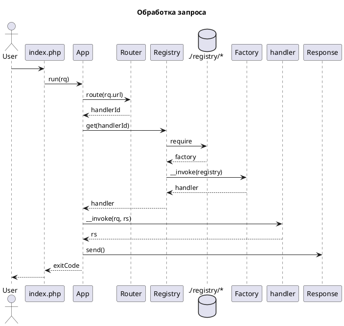

# Архитектура фрэймворка

Фрэймворк предназначен для построения неинтерактивных приложений, обработчиков запросов.

## Обработака запроса

## Внедрение зависимостей

Фреймворк содержит решение основанное на реестре Registry и фабрике зависимостей Factory. Реестр получает зависимости, подключая файл скрипта-фабрики (скрипт возвращает фабрику через return).

Любой сервис или обработчик запроса является экземпляром Factory и может иметь зависимости или быть чьей-то зависимостью. Например, объект приложения App находит нужный обработчик запроса через реестр.

