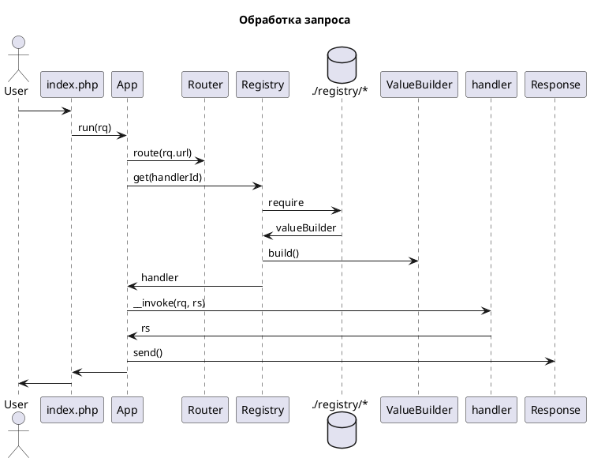

# Архитектура фрэймворка

Фрэймворк предназначен для построения неинтерактивных приложений, обработчиков запросов.

## Обработака запроса

## Внедрение зависимостей

Фреймворк содержит решение основанное на реестре Registry и построителе значений ValueBuilder. Реестр ищет скрипты-фабрики значений в файловой системе (return из подключённого файла), если в результате получает ValueBuilder, то вызывает его метод build, который получает зависимости, вызывая Registry::get (косвенная рекурсия), и строит значение.

Любой сервис или контроллер описывается как ValueBuilder и может иметь зависимости или быть чей-то зависимостью.

